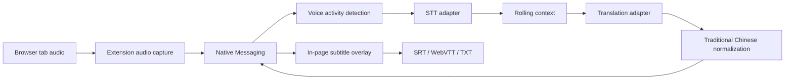

# Architecture

## System overview



## Components

### Browser extension

- Captures audio from a user-selected tab after an explicit user action.
- Converts audio to the protocol's canonical PCM format.
- Maintains the session UI and subtitle overlay.
- Sends bounded audio chunks to the native host.
- Receives status, provisional transcripts, confirmed transcripts, and translated subtitles.
- Contains thin browser-specific adapters for Chrome and Firefox.

Chrome's capture adapter uses `tabCapture`. Firefox does not expose the same
extension API, so its adapter must use Firefox-supported display/tab media
capture with an explicit browser selection prompt. The protocol and local
model pipeline remain shared; browser capture parity is a tracked delivery
risk rather than an assumption.

### Local service

- Starts on demand through Native Messaging and exits after the session becomes idle.
- Performs voice activity detection, speech recognition, translation, normalization, and timing.
- Selects GPU or CPU execution based on detected capabilities.
- Uses only Ollama's loopback API for local TranslateGemma inference; it does not send
  subtitle content to a remote service.
- Never writes audio or subtitle text to disk unless executing an explicit export operation.

### Shared protocol

Every message has a protocol version, message type, session ID, and monotonic sequence number where ordering matters. Model-specific details stay behind service adapters and do not cross the protocol boundary.

## Replaceable engines

Speech-to-text and translation engines implement stable internal contracts:

```text
SpeechToTextEngine
  load(config)
  transcribe(audio_chunk, session_context)
  reset()
  unload()

TranslationEngine
  load(config)
  translate(text, source_language, target_language, context)
  unload()
```

The alpha adapters are Faster Whisper and TranslateGemma through Ollama. NLLB remains
available as a replaceable fallback adapter, and future engines must satisfy the same contract.

## Streaming rules

- Canonical audio: mono, signed 16-bit PCM, 16 kHz.
- Audio chunks carry sequence numbers and capture timestamps.
- Backpressure is explicit; the extension must not build an unbounded queue.
- Provisional subtitle updates replace the current segment.
- Confirmed subtitle segments are immutable.
- Speech recognition runs once per 800 ms audio chunk. Translation is throttled to roughly
  400 ms and still waits for a finalized utterance or a sentence that remains stable across
  two recognition passes.

## Security boundaries

- Native Messaging host manifests allow only the installed extension IDs.
- Messages are validated before processing.
- Model files are downloaded only after consent and verified against recorded hashes.
- Model licenses and versions are presented before download.
- No cloud fallback or telemetry endpoint exists in the MVP.
